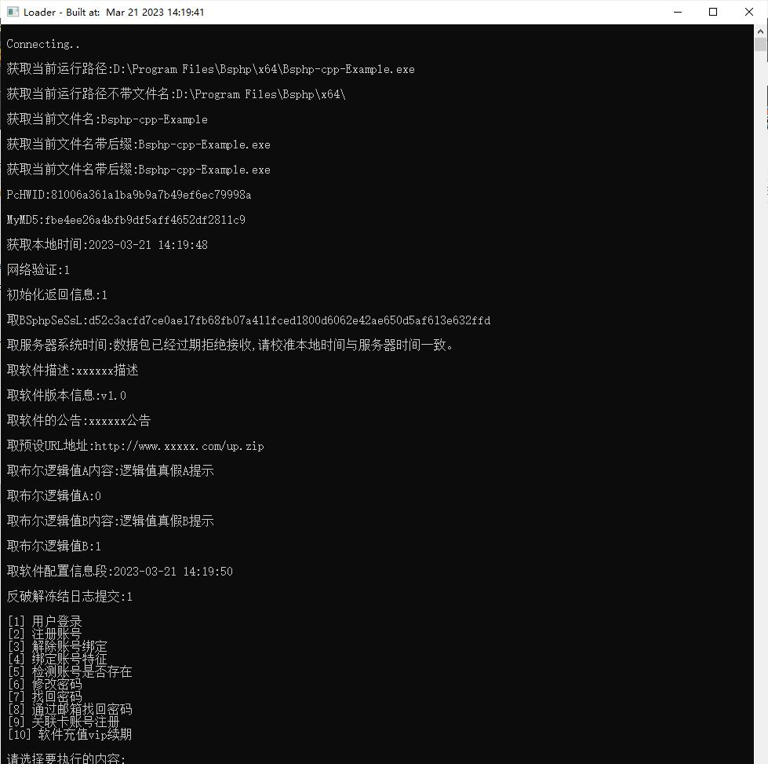
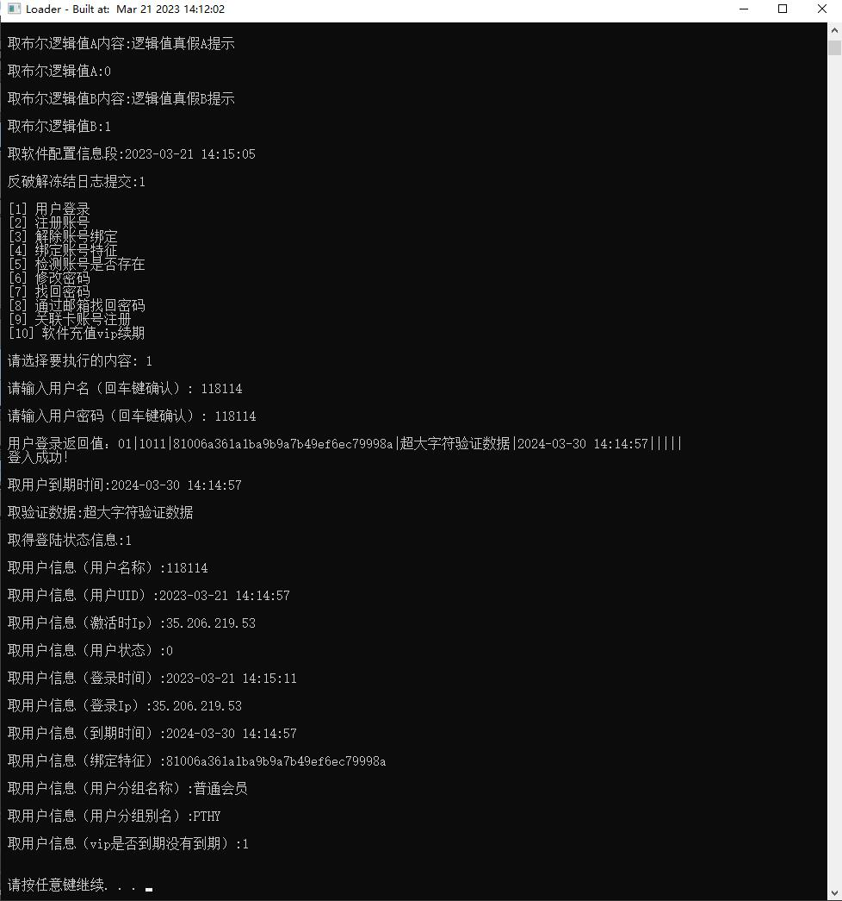
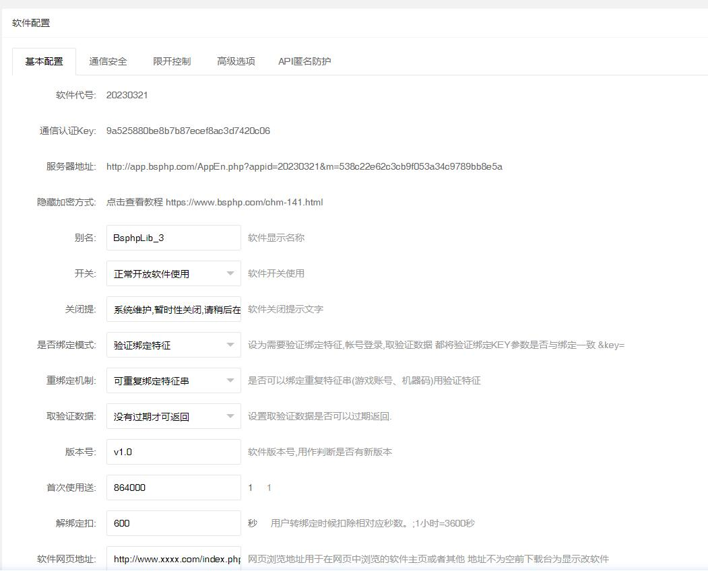
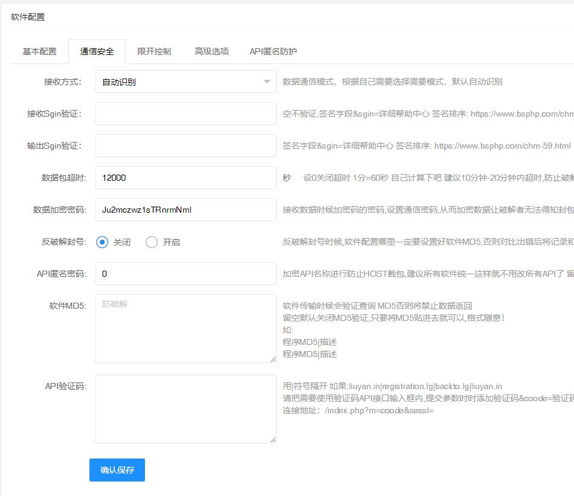
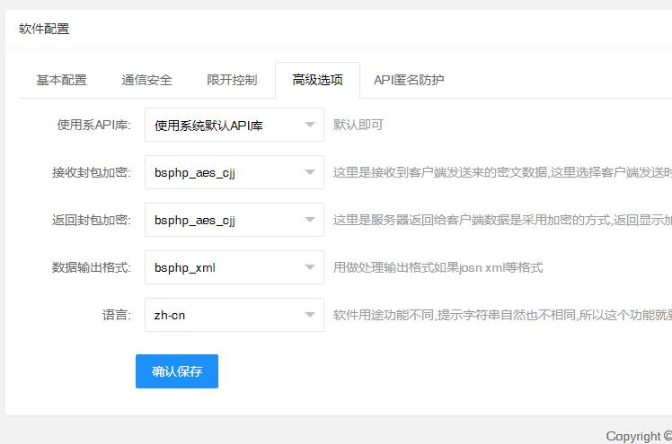

# Bsphp-example
Regarding the call of the Bsphp user management system, the use of C++ writing, 
This is only for reference and learning, and the basic API examples of login verification have been included. 
# Two categories:
1.Bsphp-cpp-Example : Example writing and usage,This way of writing can be used in your C++ programs such as EXE and DLL 
2.Bsphp-cpp-library : API integration call LIB 
# BsPHP:
1.This is the official website of this verification system, which is a paid system : https://www.bsphp.com/ 
2.This is the developer API interface sample link. : https://www.bsphp.com/chm.html 
# Project test screenshot:
 
 
 
 
 